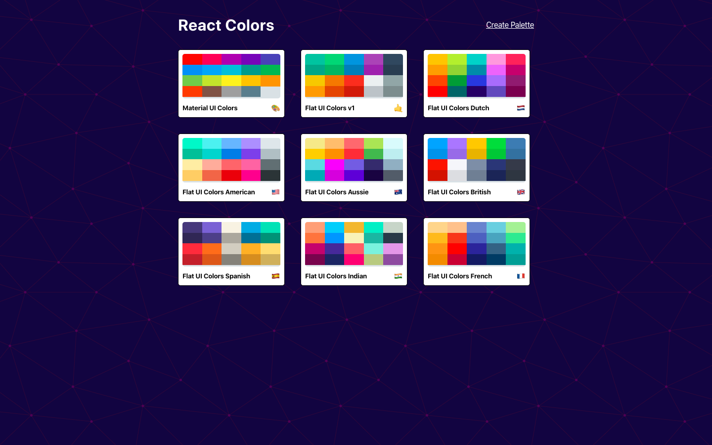
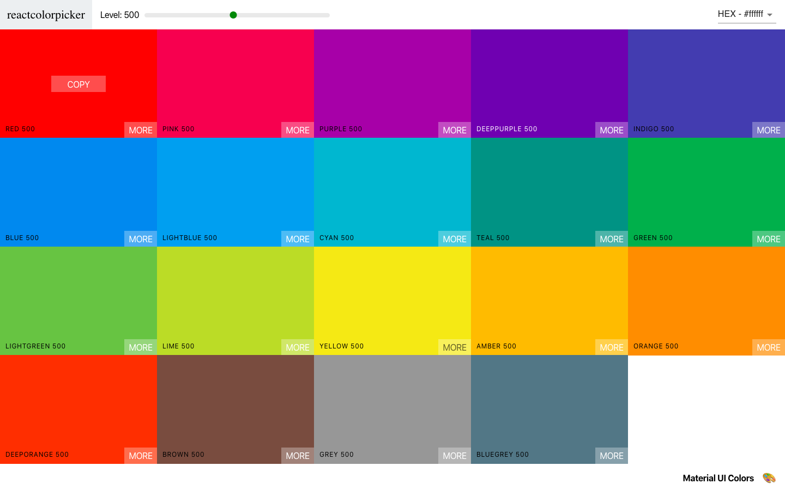
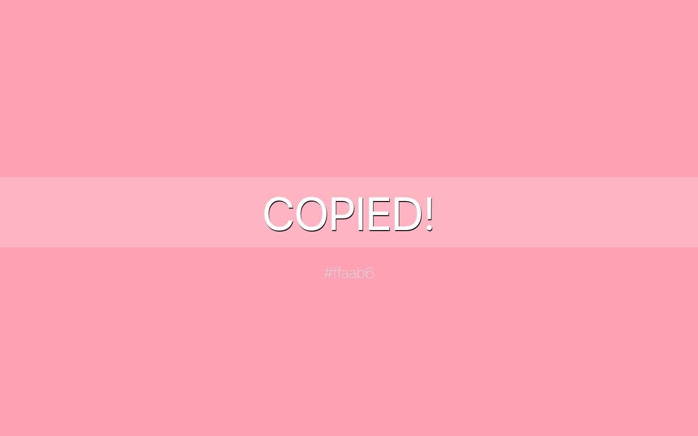
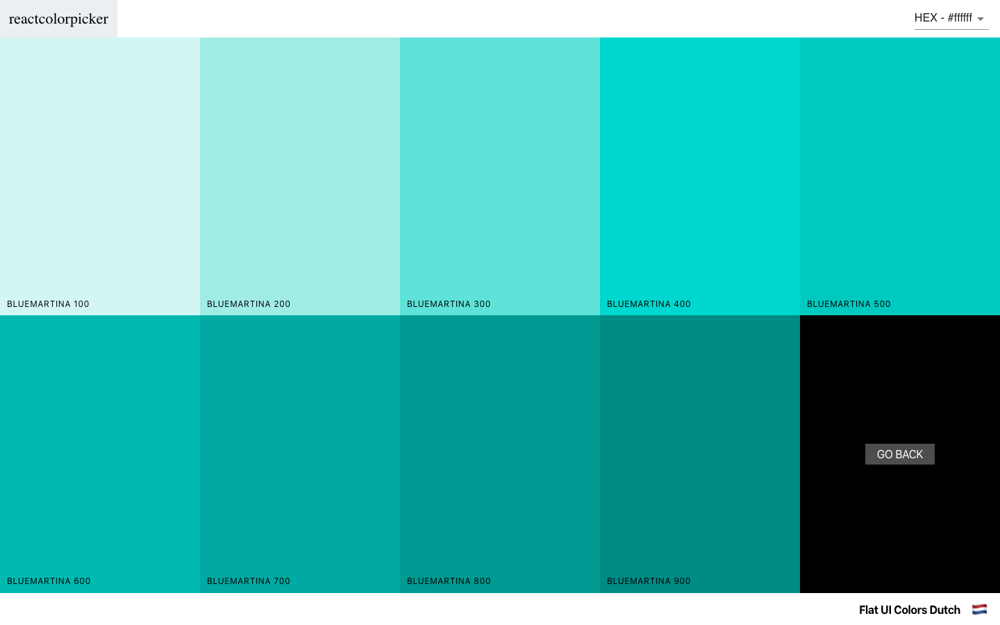
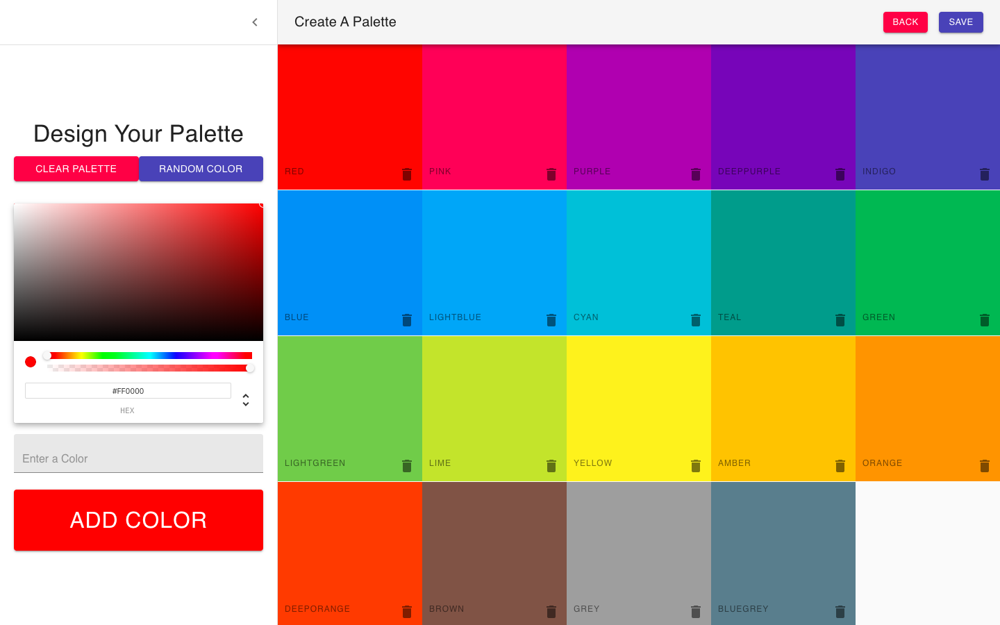

## React Color Picker

### The landing page. This shows all of the palettes currently available. There are 9 default palettes provided

### Clicking on a palette opens up all of the colors in that palette. There is a dropdown menu that allows you to change between color formats: hex, rgb, and rgba.

### Clicking on a color square will copy that color's code to your clipboard.

### Each color has a More button that allows you to view different shades of selected color

### You can design a new palette. There are pre-loaded colors, and a pop out drawer to add a new color. There is also a random color button that adds a color based on all available palettes.

####
